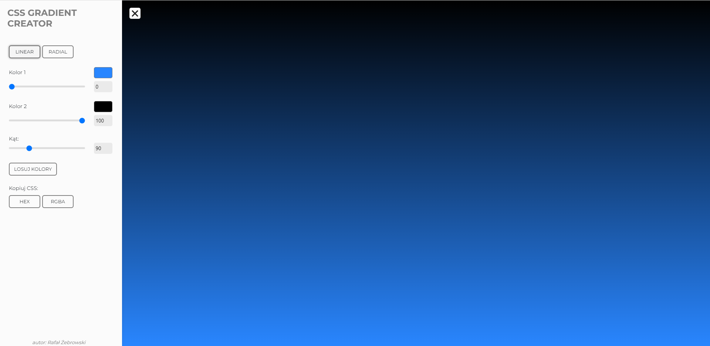

## CSS GRADIENT CREATOR

Narzędzie, dzięki któremu wygodnie wygenerujesz gotowe reguły CSS, dostowując gradient i kopiując gotowy kod.

### Demo

http://rafal-zebrowski.github.io/css-gradient-creator
